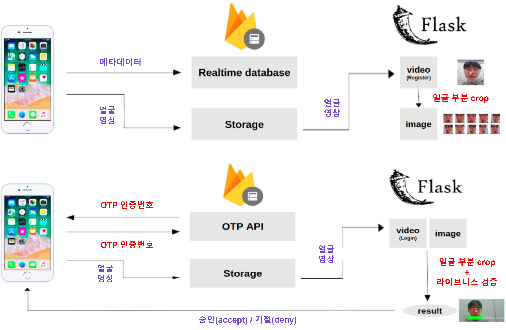
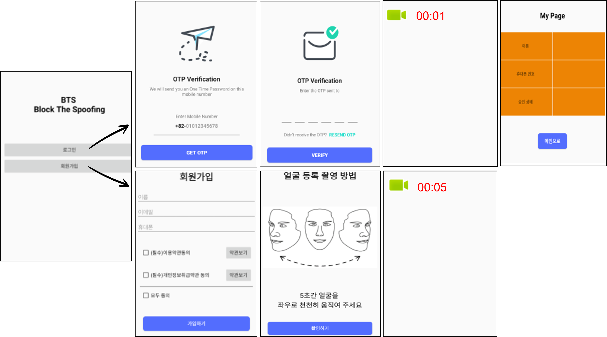

# Face Liveness Detector

## Overview
<p align="center"></p>

**Face Liveness Detector**는 실물 대신 인쇄된 얼굴 이미지나 화면상의 이미지를 비춰 생체 인증을 통과하는 Spoofing 범죄를 방지하기 위해 얼굴의 생동감(Liveness) 감지 및 얼굴 인식(Face recognition)을 동시에 수행하는 Anti-Spoofing 안면 인증 프레임워크입니다.  감지된 얼굴의 실물 여부와 등록 여부를 실시간으로 파악하여 결과를 반환합니다. 이를 활용하여 최종적으로 OTP와 얼굴 인증을 수행하는 Multi factor 인증 앱 [BTS](https://github.com/jamwomsoo/spoofingproject)를 구현했습니다. 


## Project Details

- AI hub 한국인 안면 데이터셋, LFW 안면 이미지, NUAA Imposter dataset 활용
- 얼굴 부분만 crop하고 brightness를 조정하는 데이터 전처리 진행
- 안면의 real/fake 구분하는 CNN 모델을 직접 설계
- validation loss = 0.2782, validation accuracy = 0.9005
- face-recognition 라이브러리를 통해 얼굴 인식 수행

## Build and run(Local)

### Step 1. 원격 저장소 git clone

```
git clone https://github.com/herbwood/face_liveness_detector.git
pip install -r requirements.txt
```

### Step 2. image 디렉터리에 본인 이름의 디렉터리를 만든 후 안면 이미지를 저장

### Step 3. main 파일 실행

```python
python main.py
```

## Build and run(Server)

<p align="center"></p>

### Step 1. 원격 저장소 git clone

```
git clone https://github.com/herbwood/face_liveness_detector.git
pip install -r requirements.txt
```

### Step 2. Firebase에서 프로젝트 생성 후 config/config.json에 해당 정보 수정

### Step 3. 앱 다운로드 및 ip 수정

- [BTS](https://github.com/jamwomsoo/spoofingproject) repository에서 앱 다운로드 
- Android Studio에서 `Open an existing project`를 선택하고 원격 저장소에서 다운받은 `app` 디렉터리 선택
- Wifi 연결 및 ip 주소 확인
- ```RequestHttpURLConnection.java``` 파일에서 ```public  static  String server_ip``` 변수를 현재 ip 주소로 설정 
-   안드로이드 장치를 연결한 후 Android Studio에서  `Run`  섹션을 선택하고  `Run app`  을 눌러 앱을 실행
-  안드로이드 장치를 Wifi에 연결

### Step 4.  서버 실행
```python
python server.py
```

### Step 5. 앱 실행

<p align="center"></p>
